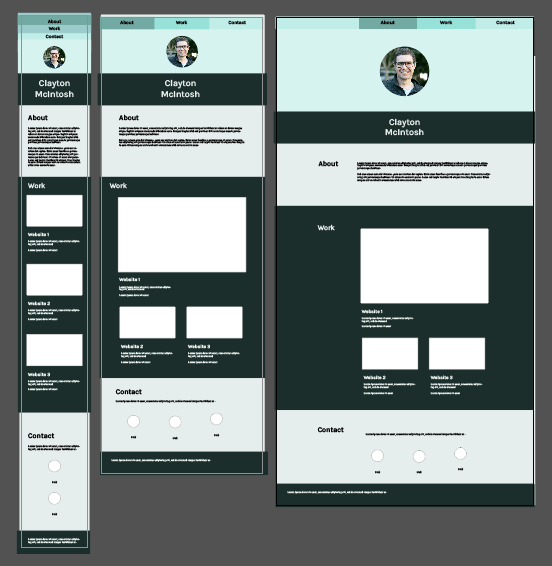

# Clayton-Mcintosh-Portfolio

## Clayton McIntosh Port Folio

This is the first application created from scratch for the Full Stack Flex Boot Camp. The task was to create a fully functional portfolio with HTML and CSS. The main aim was to make a responsive web application using flexbox, media queries and CSS variables.

I created the design for this application in Adobe Illustrator, then coded in HTML and CSS. I challenged myself to get the content of the website as close to my vision as possible. This required some thinking and testing, but I’m very happy with the result.

## Mock Up



## Acceptance Criteria

Below is the acceptance criteria of the homework:

```
GIVEN I need to sample a potential employee's previous work
WHEN I load their portfolio
THEN I am presented with the developer's name, a recent photo or avatar, and links to sections about them, their work, and how to contact them
WHEN I click one of the links in the navigation
THEN the UI scrolls to the corresponding section
WHEN I click on the link to the section about their work
THEN the UI scrolls to a section with titled images of the developer's applications
WHEN I am presented with the developer's first application
THEN that application's image should be larger in size than the others
WHEN I click on the images of the applications
THEN I am taken to that deployed application
WHEN I resize the page or view the site on various screens and devices
THEN I am presented with a responsive layout that adapts to my viewport

```
## Deployed Application

### Link:

[Homework 02 - Portfolio - Clayton McIntosh](https://claytonmcintosh.github.io/Clayton-Mcintosh-Portfolio/)

## Screenshot of Application


